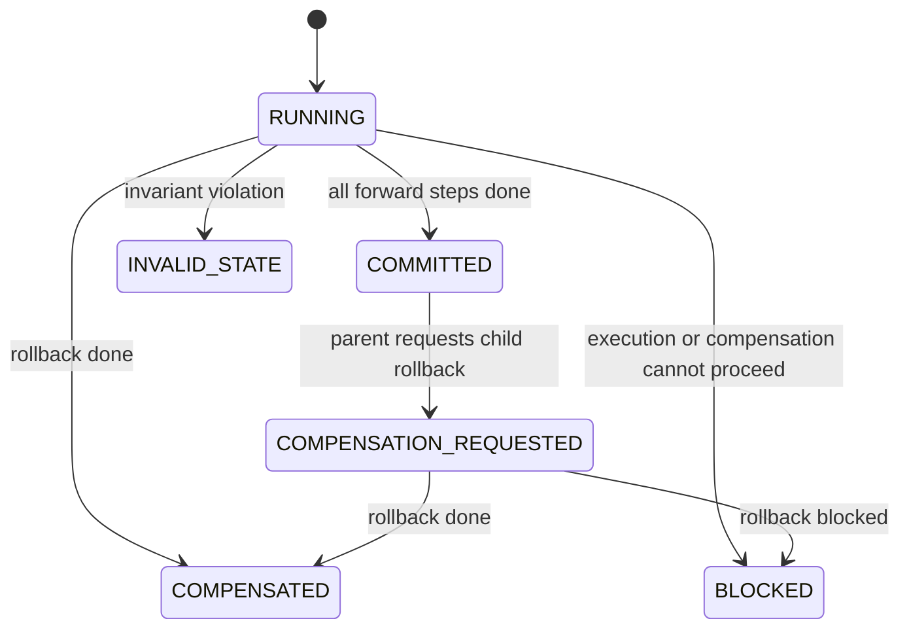
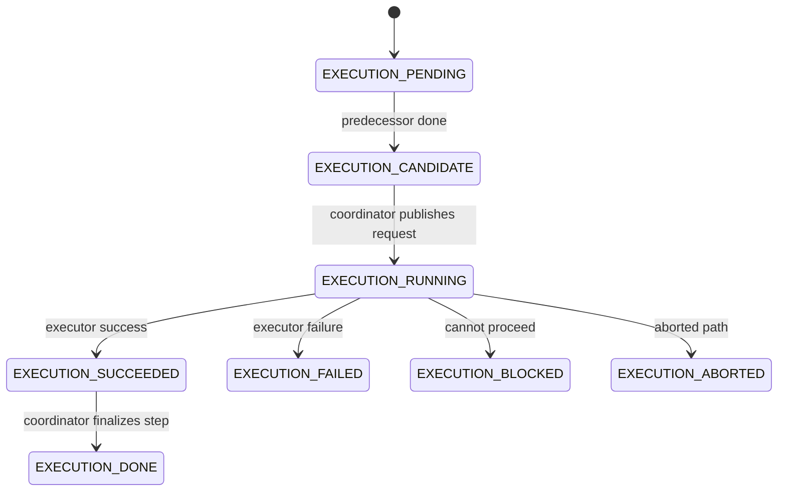
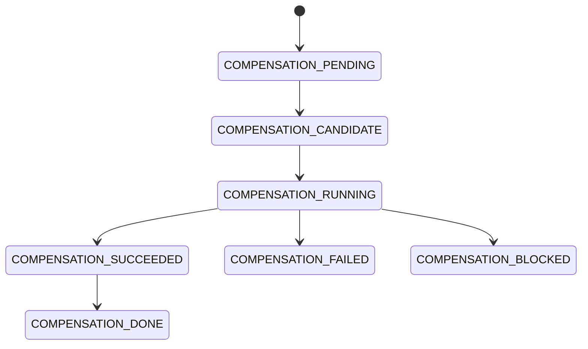

# State Machine

This page summarizes the state machine implemented in `pkg/trax/coordinator.go` and enums in `pkg/trax/const.go`.

## Saga States

Current enum values also include `PAUSED` and `CANCELLED`, but those are not the active mainline behavior.

## Forward Step States

## Compensation Step States

## Validation

`isSagaStateValid`, `validateNonCompensatingMode`, and `validateCompensatingMode` are the key invariant checks. If the current combination of saga state and ordered step states is impossible, the coordinator can mark the saga invalid.

## Notifications

Candidate state transitions emit `trax_saga_events`, waking coordinators to process the next step.
