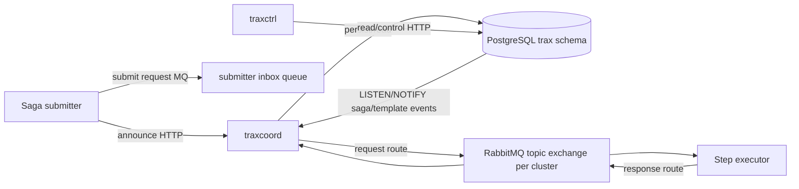

# TRAX Architecture v1

TRAX is the standalone home of the workflow and saga subsystem extracted from `daemons2`. Its job is to run durable, asynchronous, multi-step workflows where each step can be retried, inspected, and optionally compensated.

The current repo is both a reusable Go module and a runtime package:

- module: `github.com/kamcpp/trax`
- core package: `pkg/trax`
- daemons: `cmd/traxcoord`, `cmd/traxctrl`
- CLI: `cmd/traxcli`
- transport: RabbitMQ
- durable store: PostgreSQL, with an in-memory store for tests/dev paths
- coordination notifications: PostgreSQL `LISTEN/NOTIFY`
- locking/cache: Redis-backed `pkg/cache`, plus in-process guards in executors

## Boundaries

TRAX owns generic workflow mechanics:

- clusters and execution namespaces
- saga templates and saga-step templates
- saga instances and step instances
- step scheduling and result collection
- compensation state transitions
- sub-saga parent/child metadata
- operator inspection, tree, annex, and force-compensated APIs
- submitter announcement and executor routing
- resilience primitives around coordinator readiness, MQ routing, template reloads, idempotent persistence, and E2E verification

Dependent systems should own domain-specific workflows and executor implementations. The imported `daemons2` docs in `docs/imported-daemons2/` include many Agora/treasury/LASER domain saga notes because they are vital historical context, but they are not all TRAX core responsibilities.

## Runtime View



## Core Components

`traxcoord` is the runtime coordinator. It accepts submitter announcements, initializes per-cluster MQ topology, reloads templates, consumes saga submission messages, schedules runnable steps, consumes step results, and drives the forward/compensation state machine.

`traxctrl` is the control and read plane. It exposes cluster CRUD, saga-template CRUD, saga-step-template CRUD, saga and step instance queries, hierarchy/tree queries, saga annex storage, testing-only DB switch helpers, smoke-template creation, and the operator escape hatch for force-marking a blocked saga as compensated.

`traxcli` is the operator/developer CLI. It can act as a template manager, submitter, executor runner, and watcher depending on subcommand.

`pkg/trax` is the reusable library. It defines the store, coordinator, submitter, executor, messages, state enums, idempotent-service contract, sub-saga context, and watch helpers.

`pkg/mq` is the TRAX RabbitMQ wrapper. The standalone repo narrowed `pkg/mq/init.go` to TRAX-specific exchange setup rather than carrying the full `daemons2` MQ graph.

`pkg/cache` provides mutex/cache implementations. Redis mutexes are used by coordinator processing to avoid concurrent mutation of the same saga instance.

## Event And Notification Channels

PostgreSQL is the state authority. RabbitMQ is the execution transport. PostgreSQL notifications reduce polling latency but do not replace persistent state.

Current channels:

- `trax_saga_events`: emitted when saga-step instances become execution or compensation candidates. Coordinators subscribe and immediately scan for work.
- `trax_template_events`: emitted when saga or step templates are inserted, updated, or deleted. Coordinators subscribe and reload/adjust runtime bindings.

The store supports multiple `LISTEN` channels through one listener and fans notifications out inside the coordinator.

## Routing Model

TRAX uses a per-cluster RabbitMQ topic exchange for saga-step traffic:

```text
x_{cluster_id}_trax_saga_steps
```

Routing keys follow:

```text
{cluster_id}.{coordinator_affinity}.{saga_template_id}.{saga_step_template_id}.{request|response}
```

Executor inbox binding:

```text
{cluster_id}.*.{saga_template_id}.{saga_step_template_id}.request
```

Coordinator results binding:

```text
{cluster_id}.{coordinator_affinity}.*.*.response
```

Executors are therefore bound by step type, while coordinators receive responses for their own affinity group.

## State Authority

All durable truth is in PostgreSQL tables under the `trax` schema. Cluster-independent tables hold clusters and templates. Cluster-scoped instance tables are generated from cluster IDs, for example:

```text
trax.{cluster_id}_saga_instances
trax.{cluster_id}_saga_step_instances
trax.{cluster_id}_saga_annexes
```

Cluster IDs are normalized for table names by replacing `-` with `_`.

## Runtime Lifecycle Summary

1. `traxcoord` starts, initializes store, listens on `trax_saga_events` and `trax_template_events`, initializes known step queues from templates, and starts per-cluster processing loops.
2. A submitter announces to `traxcoord` through HTTP and receives cluster IDs plus inbox/outbox names.
3. The submitter starts consumers for submission responses and marks itself ready only after cluster IDs are available.
4. The submitter publishes a saga submission request.
5. The coordinator creates one saga instance and one step instance per step template, with idempotent keys and initial states.
6. Candidate step notifications wake the coordinator.
7. The coordinator locks the saga instance, validates state, sends execution or compensation requests, and persists each transition.
8. Executors consume requests, run an `IdempotentService`, and publish step results.
9. The coordinator advances the saga to the next step, terminal commit, compensation, blocked, or invalid state.

## Current Extraction Gaps

The repo is usable as the canonical TRAX home, but some extraction seams remain:

- `deploy/k8s/init/init_trax_pgsql.sql` only creates base template/cluster tables; runtime cluster-specific instance tables are created by `pkg/trax/store_psql.go` during store initialization.
- `go.mod` and `pkg/common` still carry inherited breadth from `daemons2`.
- Some imported docs refer to Agora services, LASER, treasury, CSD, exchange, or participant agents. Those are source-system examples and backlog context, not mandatory TRAX dependencies.
- Generated Swagger packages are expected by daemon API code but may need generation before image builds.
- The current shell Go binary on this machine was observed as Go 1.17 during the extraction sanity check, while the code requires a modern Go toolchain.
