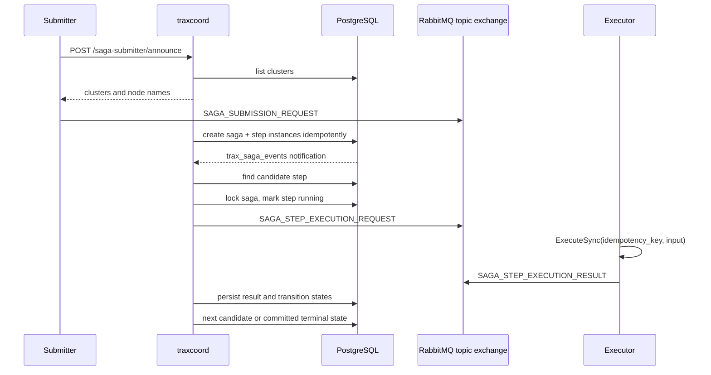
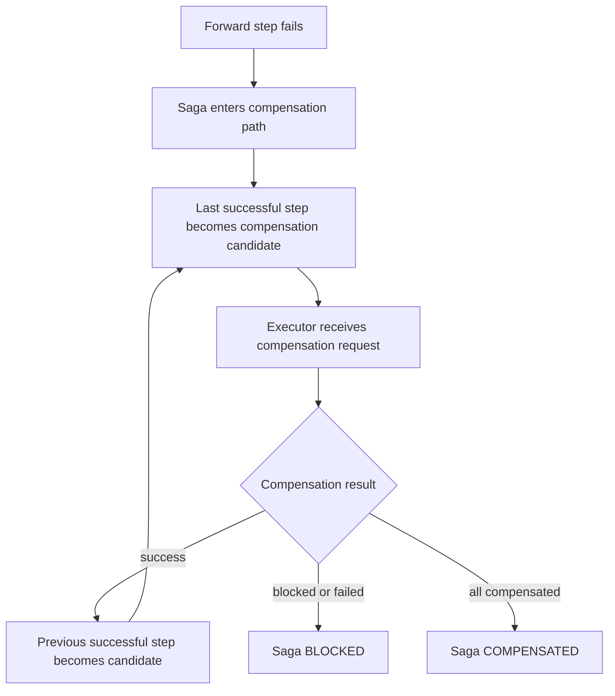

# Saga Lifecycle

This page describes the forward execution and compensation paths implemented in `pkg/trax`.

## Forward Path

## Submission

`SagaSubmitter.SubmitSaga` creates a TRAX message containing:

- cluster ID
- trace ID and execution ID
- zone ID
- origin and origin idempotency key
- tags and metadata
- saga template ID
- input map

`SubmitSubSaga` adds hierarchy fields:

- parent saga instance ID
- parent saga step instance ID
- root saga instance ID
- saga depth

The submitter is only ready when it has successfully announced and received at least one cluster ID.

## Step Creation

The coordinator reads the saga template and ordered step template IDs. It creates:

- one `SagaInstance`
- one `SagaStepInstance` per template step

The first step becomes `EXECUTION_CANDIDATE`; later steps are `EXECUTION_PENDING` until predecessors finish.

## Step Scheduling

A candidate notification wakes `processSagaSteps`. The coordinator:

1. queries candidate step rows by affinity and state;
2. locks the saga instance through the cache mutex;
3. validates saga/step state;
4. updates the step to running;
5. publishes a step execution request over the per-cluster topic exchange.

The mutex body uses a bounded context so the lock TTL does not expire while processing is still running.

## Executor Contract

Executors implement `IdempotentService`:

- `ExecuteSync(ctx, idempotencyKey, input)`
- `ExecuteAsync(ctx, idempotencyKey, input, callback)`
- `CompensateSync(ctx, idempotencyKey, input)`
- `CompensateAsync(ctx, idempotencyKey, input, callback)`

The current executor runner uses the sync methods and publishes a result status:

- `SUCCESS`
- `IN_EXECUTION`
- `FAILED`
- `RETRY`
- `ERROR`

Sub-saga executors can detach long-running work so the MQ callback returns quickly while the background execution later publishes the real result.

## Terminal States

A saga may reach:

- `SAGA_STATE_ENUM_COMMITTED`: all forward steps completed.
- `SAGA_STATE_ENUM_COMPENSATED`: rollback completed after failure.
- `SAGA_STATE_ENUM_BLOCKED`: manual intervention is required.
- `SAGA_STATE_ENUM_INVALID_STATE`: the state machine found an impossible transition or data condition.

`traxctrl` can force-mark a `BLOCKED` saga as compensated with a required audit reason. The store refuses this operation unless the saga is currently blocked.

## Compensation Path

When forward execution fails in a way requiring rollback, TRAX walks previously successful steps backward and schedules compensation candidates.

Forward output and compensation output are stored separately on the step instance.
