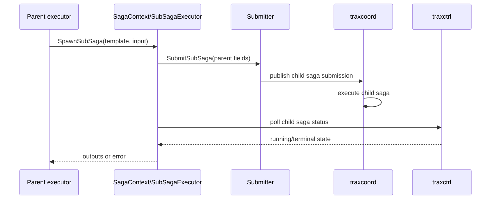

# Sub-sagas And Hierarchy

TRAX supports nested workflows. A step executor can spawn a child saga and wait for it while preserving parent-child metadata.

## Hierarchy Fields

Child saga instances store:

- `parent_saga_instance_id`
- `parent_saga_step_instance_id`
- `root_saga_instance_id`
- `saga_depth`

The root saga has itself as the root and depth zero. Children increment depth.

## Runtime Sequence

## Long-running Sub-saga Protection

Sub-sagas can take longer than a normal MQ callback window. The executor has a detached execution mode for sub-saga-enabled executors:

- it records an in-flight entry by idempotency key;
- it returns `IN_EXECUTION` quickly to avoid blocking the MQ callback;
- it runs the real work in a background goroutine with saga context;
- it publishes the real result to the coordinator when complete;
- duplicate deliveries for the same idempotency key see the in-flight guard and return `IN_EXECUTION`.

This prevents duplicate concurrent execution when a long-running child saga outlives a callback timeout.

## Query Surface

`traxctrl` exposes:

- direct child query: `POST /api/v1/saga-instances/{id}/children`
- full root hierarchy query: `POST /api/v1/saga-instances/{id}/tree`

The E2E suite includes deep sub-saga and hierarchy scenarios.
